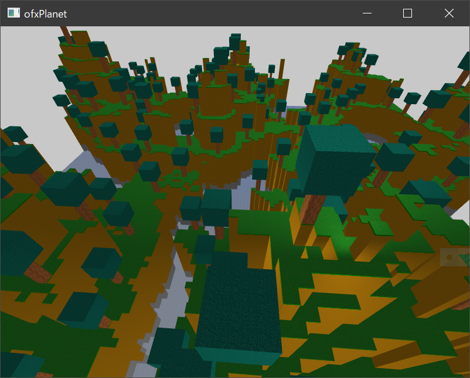

ofxPlanet
=====================================

ofxPlanet is terrain generator.

Introduction
------------
ofxPlanet is terrain generator.  
generate terrain strucutred by only plane using OpenGL instancing function.  
* can generate terrain by 2d perlinnoise
* can generate cave by 3d perlinnoise
* can generate custome structure using weighting table

License
-------
MIT License

Installation
------------
this folder into the `openFrameworks/addons/` folder.

Dependencies
------------
* [ofxSOIL](https://github.com/desktopgame/ofxSOIL)

Compatibility
------------
* of_v0.10.1_vs2017_release
* Windows10

Known issues
------------
known problem is none.

Version history
------------

### Version 0.1 (2020/02/03):
first release

